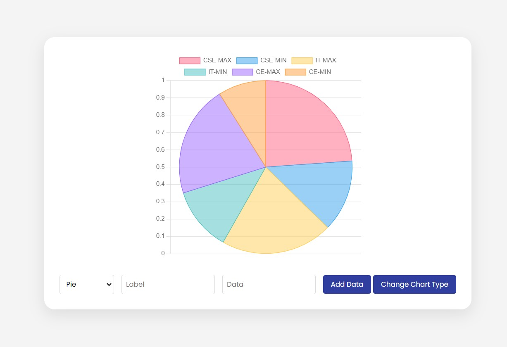

# Live Chart Generator

## 🌟 What You'll Learn:
- Understanding Chart.js: Get to grips with the basics of this versatile library and how it can transform your data visualization game.
- Real-Time Data Integration: Learn how to seamlessly feed live data into your charts.
- Five Chart Modes: Explore five different chart types - from line graphs to bar charts, and understand when and how to use them effectively.
- Button to take screenshot automatically.
- GitHub pages site: https://ankit-saha-iiitbbsr.github.io/live-chart-generator/

# Screenshot
Here we have project screenshot :

